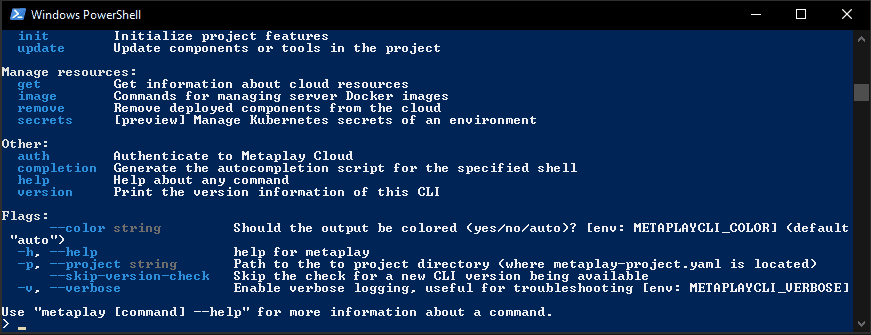

# Metaplay CLI

## Description

The `metaplay` command-line tool is used to manage projects using Metaplay, to build and deploy the game server into the cloud, and to interact with the cloud environments.



## Installation

The installation is easiest using any of the supported package managers or install scripts.

### On macOS

Using Homebrew (recommended):

```bash
brew tap metaplay/homebrew-tap
brew install metaplay
```

Using install script:

```bash
bash <(curl -sSfL https://metaplay.github.io/cli/install.sh)
```

### On Windows

Using Scoop (recommended):

```bash
scoop bucket add metaplay https://github.com/metaplay/scoop-bucket
scoop install metaplay
```

Using Chocolatey the package installed from the public feed is most likely outdated, as the review process is manual and very slow. Therefore, we recommend running the CLI's built-in update command immediately after installing:

```bash
choco install metaplay
metaplay update cli
```

### On Linux

Using install script:

```bash
bash <(curl -sSfL https://metaplay.github.io/cli/install.sh)
```

### Direct Download

You can find the latest release on our [Github releases page](https://github.com/metaplay/cli/releases/latest).

* We provide 64-bit builds for Linux, macOS (both Intel and Apple Silicon), and Windows.

* Download the correct archive for your OS and CPU architecture as indicated on the filename (e.g. `MetaplayCLI_0.1.0_Linux_x86_64.tar.gz`).

* Unpack the contents into a directory that is included in your `PATH` environment variable, or create a new directory and add it to your `PATH`.

* Now you can run the `metaplay` executable in your terminal and it will output further instructions. See section [Usage](https://github.com/metaplay/cli?tab=readme-ov-file#usage) for details.

## Usage

### Integrate Metaplay SDK to Your Game

You can add Metaplay SDK to your game using the integration wizard in the CLI by running:

```bash
MyProject$ metaplay init project
```

This will link your local project to the [Metaplay Portal](https://portal.metaplay.dev), donwload and extract the SDK, add the game-specific backend project, and add some samples on how to get started.

### Build and Deploy Server to Cloud

You must run the steps in the same directory as your `metaplay-project.yaml` project config file
is located.

First, build the game server docker image.

```bash
MyProject$ metaplay build image <image>:<tag>
```

Then, deploy the game server to an environment:

```bash
MyProject$ metaplay deploy server <environment> <image>:<tag>
```

The command also pushes the docker image to the environment's registry.

### View Game Server Logs

To get logs from your game server running in the cloud, use the following:

```bash
metaplay debug logs ENVIRONMENT
```

By default, it shows time-ordered logs from all pods, but you can also only target a single pod with:

```bash
metaplay debug logs ENVIRONMENT --pod=POD_NAME
```

It's enough to provide only the environment ID's suffix. For example, in project `lovely-wombats-build`, the environment `lovely-wombats-build-quickly` can be targeted with just:

```bash
metaplay debug logs quickly
```

Alternatively, you can run the command without any parameters and the CLI will ask you the project and environment:

```bash
metaplay debug logs
```

### Kubernetes Access

To access the Kubernetes control plane for your environment, you can do the following:

```bash
# Get the kubeconfig file for the environment.
metaplay get kubeconfig ENVIRONMENT -o <pathToKubeconfig>
# Configure kubectl to use the kubeconfig file.
export KUBECONFIG=<pathToKubeconfig>
# Check the status of your pods.
kubectl get pods
```

By default, the generated `kubeconfig` file will invoke the `metaplay` CLI itself to resolve the credentials used to communicate with the Kubernetes control plane.

### Using in CI Jobs

For detailed instructions on how to set up your CI system, see the [Setup CI Pipeline](https://docs.metaplay.io/cloud-deployments/setup-ci-pipeline.html) guide.

### Tips & Tricks

#### Working Directory

It's generally easiest to run the `metaplay` CLI in your project directory, i.e., where `metaplay-project.yaml` is located. This way the CLI knows the project you're working with and can target operations to operate on that.

If you wish to run in another directory, provide the path to the project directory with `-p <pathToProject>`.

#### Troubleshooting the CLI

If you have any issues running a command, give it the `--verbose` flag to get more detailed output on what is happening, e.g.:

```bash
metaplay deploy server <environment> <image>:<tag> --verbose
```

#### Multiple Sessions

The CLI supports storing multiple sessions at the same time. This can be useful when working with projects that use 3rd party authentication instead of Metaplay Portal for their authentication.

The authentication provider is determined from the `metaplay-project.yaml` and thus any authentication operations are dependent on the project in the context of which the CLI is run.

### Support & Feature Requests

If you have a paid support contract with Metaplay, you can open a ticket on the [Metaplay portal's support page](https://portal.metaplay.dev/orgs/metaplay/support).

### Development

#### Development Build

We continuously create development builds from the `metaplay/cli` repository `main` branch. These builds are tagged with a `-dev.N` suffix (e.g., `1.2.4-dev.1`) and published as draft releases. You can find the latest development build on the main [releases page](https://github.com/metaplay/cli/releases). The development builds are primarily intended for testing purposes and should generally not be used.

Development builds do not currently perform any version checks (for the purpose of new release notifications), and the `update cli` command is disabled on development builds as well. If you need to override this behavior, you can mock up a specific version number with the following:

```bash
cli$ go build -ldflags="-X 'github.com/metaplay/cli/internal/version.AppVersion=<major.minor.patch>'" .
```

It is highly recommended to use the latest official release, so should you decide to mess with development builds, proceed with extreme caution!

#### Build Locally

There is a simple `Makefile` which builds the CLI into the `dist/` directory when run:

```bash
cli$ make
```

It can be convenient to set the `cli/dist` directory to your `PATH` to make it easier to run the CLI from any directory.

#### Run Locally

While developing the CLI itself, it's often most convenient to run the binary from source and direct it to operate on a project with the `-p` flag, e.g.:

```bash
cli$ go run . -p ../MyProject debug shell
```

When working on authentication-related features on Windows, you can avoid the network confirm dialog from being asked each with the following:

```bash
cli$ go build . && cli.exe auth login
```

#### Unit Tests

To run all unit tests:

```bash
cli$ go test ./...
```

#### Platform Tests

Most of the testing of the CLI is done using Metaplay's internal platform tests. The CLI does very little in isolation so there's not much that can be tested without the surrounding components.

## Publishing and CI

There are two types of releases published:

* Pre-release versions (with `-dev.X` suffix), done for each commit to `main`.
* Official releases (with no suffix), done for each version tag (e.g., `1.2.3`).

### Steps to Publish

1. Merge all relevant PRs into `main`.

2. Wait for the pre-release version (e.g., `v1.2.3-dev.4`) to get published.

3. Run the Metaplay internal [platform tests](https://github.com/metaplay/sdk/actions/workflows/platform-tests-new.yaml).

    The latest CLI pre-release version is also covered by the platform tests.

4. Tag the latest `main` (which was tested in the previous step) with the version number, e.g., `1.2.3` and push the tag.

    This triggers the release process, which publishes the official release. It takes about 30min to publish.

## License

This module and all files within are distributed under the Apache-2.0 license.
